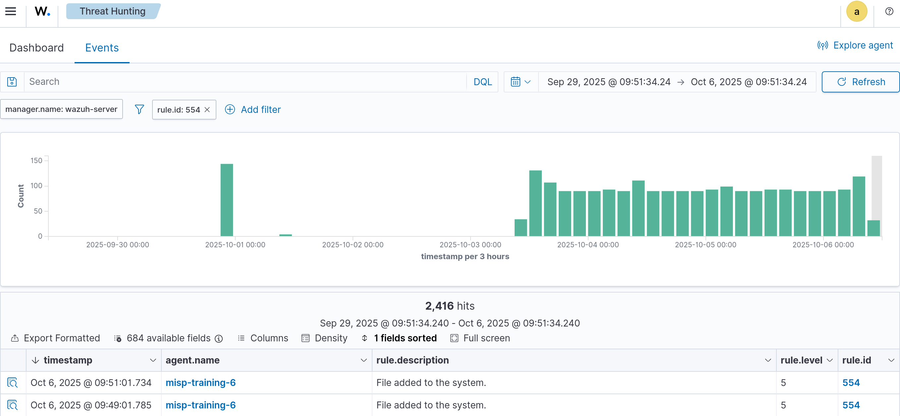
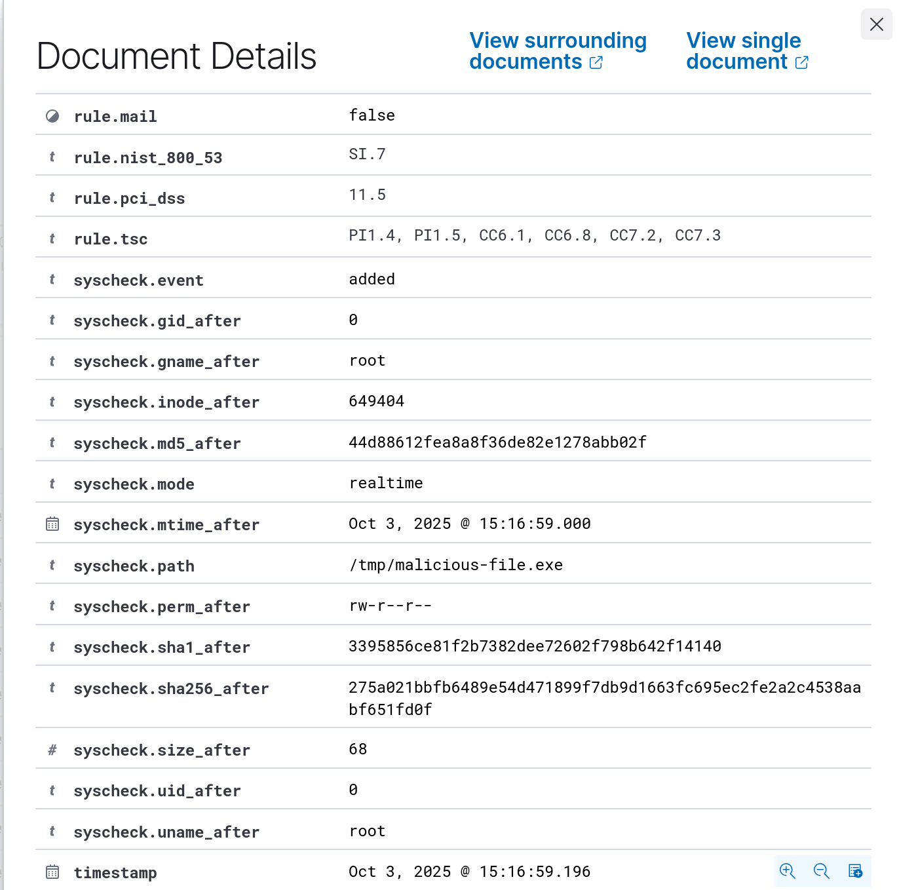
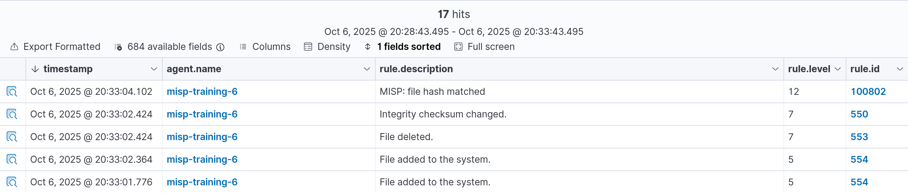

# wazuh-integration
Wazuh rules and integration script for querying file hashes against a MISP instance, generating alerts on matches, and optionally pushing sightings.

## Wazuh
### Configuring directory monitoring
First we need to configure our Wazuh agents to enable filesystem monitoring on the directories we are interested in.

On Ubuntu the agent configuration file is usually located in `/var/ossec/etc/ossec.conf`.

We can instruct the Wazuh agent to monitor a directory using the `<directories>` configuration block as follows:

```xml
<ossec_config>
  <syscheck>
    <disabled>no</disabled>
    <directories check_all="yes" realtime="yes">MONITORED_DIRECTORY_PATH</directories>
  </syscheck>
</ossec_config>
```

> `check_all` allows checks of the file size, permissions, owner, last modification date, inode, and the hash sums (MD5, SHA1, and SHA256).

When a new file is added to the monitored directory, Wazuh generates an alert (`ID 554`) containing file metadata such as hashes, file size, name, and permissions.

>
> After making changes to the `ossec.conf` file, restart the Wazuh agent to apply the configuration changes.
> 
> `systemctl restart wazuh-agent`


Now, create a file in the monitored directory and you should see an `ID 554` on the Wazuh Threat Hunting dashboard.





## MISP integration
Wazuh includes an *Integrator* module that lets us automate interactions with external services. It already provides built-in integrations for popular platforms like Slack, PagerDuty, VirusTotal, Shuffle, and Maltiverse. 

In this lab, we’ll take advantage of its flexibility to build our own custom integration using a Python script. This will allow Wazuh to communicate with our MISP instance and automatically check new file hashes against known threat indicators.

### MISP integration script

Based on the VirusTotal integration script, we wrote a new script called `custom-misp-file-hashes.py`. This file must be placed in the `/var/ossec/integrations` directory in the Wazuh Server.


Download the [custom-misp_file_hashes.py](scripts/custom-misp_file_hashes.py) script.
After adding the script in the `/var/ossec/integrations` directory, we have to adjust the file permissions:

```bash
chmod 750 misp_file_hashes.py
chown root:wazuh misp_file_hashes.py
```


> **Important:** When creating a custom integration, the Python script file name **has** to start with `custom-`, otherwise the _Integrator_ module will ignore it. 

Next, configure Wazuh server to use this integration by adding the `<integration>` block to the `/var/ossec/etc/ossec.conf` file.


```xml
<ossec_config>
    <integration>
        <name>custom-misp_file_hashes.py</name>
        <hook_url>https://YOUR_MISP_INSTANCE</hook_url>
        <api_key>YOUR_API_KEY</api_key>
        <group>syscheck</group>
        <rule_id>554</rule_id>
        <alert_format>json</alert_format>
        <options>{
              "timeout": 10,
              "retries": 3,
              "debug": false,
              "tags": ["tlp:white", "tlp:clear", "malware"],
              "push_sightings": true,
              "sightings_source": "wazuh"
          }
        </options>
    </integration>
</ossec_config>
```

* `<hook_url>`: Your MISP instance URL.
* `<api_key>`: A valid MISP API AuthKey.
* `<group>`: Filters alerts sent to the integration script only if they belong to a given list of groups. The allowed values are any rule group or comma-separated rule groups.
* `<rule_id>`: filters alerts by rule ID. The allowed values are any rule group or comma-separated rule groups.

>
> After making changes to the `ossec.conf` file, restart the Wazuh Manager to apply the configuration changes.
> 
> `systemctl restart wazuh-manager`

### Wazuh rules
Once we are receiving file creation alerts from our agent and these are being processed by our MISP integration, we need to define some rules in Wazuh.

In the Wazuh UI, navigate to _Server Management_ → _Rules_, then click _(+) Add new rules file_.

Name the file [misp_file_hashes.xml](rules/misp_file_hashes.xml).

Add the following content to the rules file:

```xml
<group name="misp,malware,">
    <rule id="100800" level="0">
        <decoded_as>json</decoded_as>
        <description>MISP: file hash check</description>
        <field name="integration">misp_file_hashes</field>
        <options>no_full_log</options>
    </rule>
    <rule id="100801" level="0">
        <if_sid>100800</if_sid>
        <field name="misp_file_hashes.found">0</field>
        <description>MISP: file hash not found</description>
    </rule>
    <rule id="100802" level="12">
        <if_sid>100800</if_sid>
        <field name="misp_file_hashes.found">1</field>
        <description>MISP: file hash matched</description>
    </rule>
    <rule id="100803" level="10">
        <if_sid>100800</if_sid>
        <field name="misp_file_hashes.error">403</field>
        <description>MISP ERROR: Invalid MISP credentials, check your the api_key setting configured
            in the MISP integration is valid MISP AuthKey</description>
    </rule>
    <rule id="100803" level="10">
        <if_sid>100800</if_sid>
        <field name="misp_file_hashes.error">429</field>
        <description>MISP ERROR: Rate limit exceeded, too many requests</description>
    </rule>
    <rule id="100804" level="10">
        <if_sid>100800</if_sid>
        <field name="misp_file_hashes.error">500</field>
        <description>MISP ERROR: $(misp_file_hashes.description)</description>
    </rule>
</group>
```

After saving the rules, restart the Wazuh Manager.

### Test
To trigger a positive match in MISP, add any of the `eicar.com` hashes to your MISP instance.

* **MD5:** `44d88612fea8a8f36de82e1278abb02f`
* **SHA1:** `3395856ce81f2b7382dee72602f798b642f14140`
* **SHA256**: `275a021bbfb6489e54d471899f7db9d1663fc695ec2fe2a2c4538aabf651fd0f`

> Make sure the event containing the hashes is visible to the user associated with the API AuthKey, otherwise no match will occur.

Inside the monitored host, download [eicar.com](https://secure.eicar.org/eicar.com) file to the monitored directory.

```bash
curl -Lo /tmp/malicious-file.exe https://secure.eicar.org/eicar.com
```

If we go to the _Threat intelligence_ → _Threat Hunting_ → _Events_ panel in Wazuh, a rule `ID 554` and `ID 100802` should be created. 


Done!

Additionally, you can leverage Wazuh _Active Response_ module to act on this alert and automatically delete or run additional actions. Read more about this [here](https://documentation.wazuh.com/current/user-manual/capabilities/active-response/index.html) and check [this tutorial](https://wazuh.com/blog/detecting-and-responding-to-malicious-files-using-cdb-lists-and-active-response/). 


### Debugging tips

Inside the Wazuh server, check that file creations are generating alerts:
```bash
tail -f /var/ossec/logs/alerts/alerts.log
```

Enable _Integrator_ module logs:
Open the `/var/ossec/etc/internal_options.conf` file and change the following configuration:

```
# Integrator daemon debug (server, local or Unix agent)
integrator.debug=2
```

Restart Wazuh manager:
`systemctl restart wazuh-manager`

Check _Integrator_ daemon logs:
```bash
tail -f /var/ossec/logs/ossec.log | grep wazuh-integratord
```

To enable debug mode in the integration script, add the following JSON to the `<integration>` block:
`{ "debug": true}`

Example:
```xml
<ossec_config>
    <integration>
        <name>custom-misp_file_hashes.py</name>
        <hook_url>https://YOUR_MISP_INSTANCE</hook_url>
        <api_key>YOUR_API_KEY</api_key>
        <group>syscheck</group>
        <rule_id>554</rule_id>
        <alert_format>json</alert_format>
        <options>{ "debug": true}</options>
    </integration>
</ossec_config>
```

Check the integration script logs:
```bash
tail -f /var/ossec/logs/integrations.log
```
```
# Running MISP File Hashes script
# Opening alert file at '/tmp/custom-misp_file_hashes.py-1759768502-1854171349.alert' with '{'timestamp': '2025-10-06T16:35:02.239+0000', 'rule': {'level': 5, 'description': 'File added to the system.', 'id': '554', 'firedtimes': 1, 'mail': False, 'groups': ['ossec', 'syscheck', 'syscheck_entry_added', 'syscheck_file'], 'pci_dss': ['11.5'], 'gpg13': ['4.11'], 'gdpr': ['II_5.1.f'], 'hipaa': ['164.312.c.1', '164.312.c.2'], 'nist_800_53': ['SI.7'], 'tsc': ['PI1.4', 'PI1.5', 'CC6.1', 'CC6.8', 'CC7.2', 'CC7.3']}, 'agent': {'id': '001', 'name': 'misp-training-6', 'ip': '10.64.247.71'}, 'manager': {'name': 'wazuh-server'}, 'id': '1759768502.1515375', 'full_log': "File '/tmp/systemd-private-94bf61040c334f479bf6147139111b66-apache2.service-qI66Ip/tmp/php08wBlT' added\nMode: realtime\n", 'syscheck': {'path': '/tmp/systemd-private-94bf61040c334f479bf6147139111b66-apache2.service-qI66Ip/tmp/php08wBlT', 'mode': 'realtime', 'size_after': '5265586', 'perm_after': 'rw-------', 'uid_after': '33', 'gid_after': '33', 'md5_after': '15a579c2901ec26cbef176f52402c2ff', 'sha1_after': '34f3a15884a92eb4f3039f4779e321cc4ea8cff8', 'sha256_after': 'dbfc239b5b3544a692a1846fd8fd3e356f9f110c58406a688be542777cc5f783', 'uname_after': 'www-data', 'gname_after': 'www-data', 'mtime_after': '2025-10-06T16:35:02', 'inode_after': 235626, 'event': 'added'}, 'decoder': {'name': 'syscheck_new_entry'}, 'location': 'syscheck'}'
# Requesting MISP information
# Querying MISP API
# Request result from MISP server: 1:misp_file_hashes:{"misp_file_hashes": {"error": 403, "description": "Error: Check credentials"}, "integration": "misp_file_hashes"}
# Error: MISP credentials, required privileges error
```

**References:**
* https://wazuh.com/blog/detecting-and-responding-to-malicious-files-using-cdb-lists-and-active-response/
* https://documentation.wazuh.com/current/user-manual/manager/integration-with-external-apis.html
* https://wazuh.com/blog/how-to-integrate-external-software-using-integrator/
